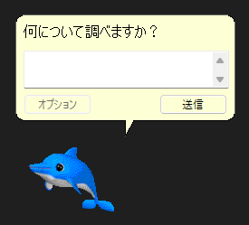

# カイルくん復活計画🐬

Microsoft AgentのACSファイルを直接読み込み、**アニメーションや音声を含めて**扱えるようにします。

本リポジトリは2023年6月に開発を始めたプライベートリポジトリの個人プロジェクトをパブリックで作り直したものとなります。

[ACSファイルの仕様](http://www.lebeausoftware.org/download.aspx?ID=25001fc7-18e9-49a4-90dc-21e8ff46aa1d)は <http://www.lebeausoftware.org/> が作成したものを使用しています。

## 開発の経緯

**TL; DR: 小学生の頃に印象深かったカイルくんを、PC上に復活させたいという願いを自分の手で叶える**

小学生の頃、Microsoft Excelで遊んでいるときにいたカイルくんが可愛かったことを覚えている。
もう一度元気に動き回る姿を見てみたいと思ったものの、世間から「お前を消す方法」と言われ続けた結果なのか、Officeアシスタントを召喚する手立てはなくなってしまっている。

そんなとき、Officeアシスタントのデータが保存されているACSファイルの仕様を第三者が解析していることを発見し、それをもとにJavaで画像データを抽出することにチャレンジした。
試行錯誤の末、画像抽出に成功した。
さらに、アニメーションデータなどを読み込んで動きを再現することに成功した。

その後、2022年末に登場したOpenAIのチャットAIを組み込むことを思いついた。
全体をPythonで再実装し、APIを組み込み、プロンプトを書いてカイルくんに命を吹き込むことに成功した。

## その他の参考リンク

- <https://learn.microsoft.com/en-us/windows/win32/lwef/animations> ([Wayback Machine](http://web.archive.org/web/20230726123635/https://learn.microsoft.com/en-us/windows/win32/lwef/animations))
- <https://learn.microsoft.com/en-us/windows/win32/lwef/agent-states> ([Wayback Machine](http://web.archive.org/web/20230726123713/https://learn.microsoft.com/en-us/windows/win32/lwef/agent-states))

※その他のMS Agent関係のlearn.microsoft.comのヘルプは現時点でWayback Machineに保存されていないので注意!

# セットアップ方法 (Poetryを使用)

1. プロジェクトのルートに移動
2. `poetry install` で必要なパッケージをインストール (もしくは、 `pyproject.toml` に従って手動で必要なパッケージをインストール)
3. FFmpegをインストール (**Windowsでは不要**)
4. カイルくんの実体 `DOLPHIN.ACS` を入手し、 `kairu/resources` に配置

# 使い方

Poetryでセットアップした場合は、 `poetry run python run.py` で起動できます。
`-help` 引数を与えると、使用できる引数の一覧が出力されます。

## 操作

- 本体はドラッグで移動可能です。
- ダブルクリックすると、ランダムなアニメーションを再生します。
- 右クリックすると、アニメーションを終了させるように要求します。
- 右ボタンでダブルクリックすると、プログラムを終了します。

## AIチャットモード

**各種LLM API (Ollama, OpenAI, Google AI Studio) が使用できる環境があれば、当時のような吹き出しのGUIで質問をすることが可能です。**

`poetry install --all-extras`を実行して必要なパッケージを追加でインストールしておく必要があります。

Ollamaの場合: `poetry run run.py DOLPHIN.ACS ollama gemma3:12b -base-url localhost:11434` で起動できます。
